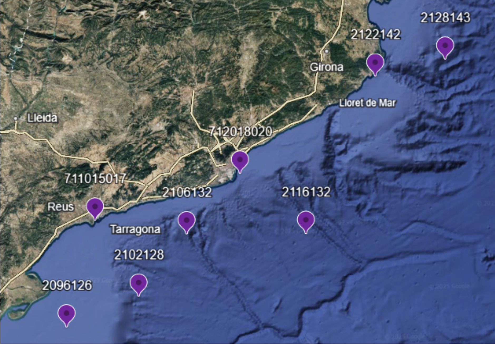

```{r, label="generaloptions", include=FALSE}
# Configuració general del tutorial
library(learnr)
knitr::opts_chunk$set(
  echo = TRUE,
  fig.width = 6,
  out.width = "50%",
  fig.align = "center",
  fig.caption = TRUE,
  fig.path = "images/"
)
```

# Introducció anàlisi cluster. Temporals a la costa catalana

## El problema

Es vol estudiar els temporals d'onatge extrem a la costa catalana. 

S'han descarregat les dades de 6 nodes SIMAR seleccionats, distribuïts al llarg de tota la costa catalana, del repositori de Puertos del Estado:

https://portus.puertos.es/#/

```{r, fig.cap="Localització dels Nodes", echo=FALSE}


```

Els nodes SIMAR són punts de simulació numèrica que proporcionen informació sobre les condicions d'onatge. 

El conjunt de dades que estudiarem conté la informació dels temporals amb altura d'ona significant màxima anual registrats a aquests 6 nodes SIMAR.
D'entre totes les variables disponibles, s'han escollit: altura d'ona significant, període mig, període pic i direcció mitjana de procedència de l'onatge.

El principal objectiu és dur a terme un anàlisis cluster, a partir de diferents mètodes (jeràrquic i no jeràrquic), que ens permeti detectar grups interpretables entre els temporals.

::: {.infobox .caution data-latex="{caution}"}
<span style="font-size: 20px; text-align: center;">**Recorda establir correctament el directori de treball** abans de començar a llegir les dades.
:::

# Preprocés

## Carregam llibreries

En primer lloc, carreguem les llibreries que necessitarem a la sessió. Recordeu que prèviament cal tenir la llibreria instal·lada. Si no disposem, per exemple, de la llibreria `factoextra` (@factoextraref), caldrà executar prèviament la seva instal·lació, i després activar-la a la sessió. En alguns casos poden aparéixer advertències sobre la versió de R que estem utilitzant, si el paquet és més recent que la versió de `R` instal·lada.

```{r libraries, message=FALSE}
#install.packages("here")
library(here)
library(cluster)
library(ggplot2)
library(car)
library(dplyr)
#install.packages("factoextra")
library(factoextra)
#install.packages("gridExtra")
library(gridExtra)
#install.packages("kableExtra")
library(kableExtra)
```

## Lectura de dades

Una vegada activades les llibreries, hem de llegir les dades d'onatge, contingudes al fitxer **"max_boies.dat"**.

::: {.infobox .circle data-latex="{circle}"}

***AVÍS!***

Per evitar que el tutorial tingui problemes amb la ubicació dels  fitxers en els diferents sistemes operatius (problema amb què ens vam trobar al Lab1), utilitzarem la llibreria `here`. 
:::

Fixem el directori de referència pel tutorial:

```{r, establimhere}
here::i_am("README2.md")

```


::: {.infobox .caution data-latex="{caution}"}
<span style="font-size: 20px; color: darkgoldenrod; text-align: right;">**Recorda obrir el conjunt de dades considerant el seu format**
:::

::: {.infobox .circle data-latex="{circle}"}

<span style="font-size: 20px;">***AVÍS!***

Obriu el fitxer **"max_boies.dat"** utilitzant el Bloc de notes.  
<span style=" color: orange;">Observeu</span> el format del fitxer: com estan separades les columnes? amb tabulador,coma, punt i coma, espai?; Estan inclosos els noms de les variables? Hi ha files inicials amb comentaris?
:::

Una vegada que hem verificat com estan emmagatzemades les dades, llegirem el conjunt de dades, tenint en compte la seva estructura, i li donarem un nom. 

::: {.infobox .caution data-latex="{caution}"}
<span style="font-size: 18px; text-align: center;">***IMPORTANT***: R diferencia majúscules i minúscules: *Dades* és diferent a *dades*. 
:::

```{r lecturadades, message=FALSE}
max_boies<-read.table("max_boies.dat", header=TRUE, sep="\t", dec=".")
```

Una vegada hem llegit les dades i les hem guardat a la memòria, convé verificar quines són les variables que conté i fer un primer cop d'ull a les dades. Veiem que la primera variable, la Direcció, té un nom molt llarg.  Substituïm aquest nom per un de més compacte: 

```{r noms, message=FALSE}
names(max_boies)
head(max_boies)
names(max_boies)[1] <- "DirMedProced"
```

Realitzem una primera descriptiva de les dades:
```{r descr}
names(max_boies)
summary(max_boies)
```
Observem que loc i ID són factors, però no s'han llegit com a tals. Cal transformar-los a factors. Fem la descriptiva de nou:

```{r factors}
max_boies$loc <- factor(max_boies$loc)
max_boies$ID <- factor(max_boies$ID)
summary(max_boies)
```

La direcció en graus no és massa visual per la descriptiva de les dades, podem dibuixar una rosa dels vents per observar de forma més intuitiva aquesta direcció.
```{r rosadelsvents,fig.cap="Rosa dels vents de DirMedProced."}
#Cream variable dels sectors per agrupar
sector <- cut(
  max_boies$DirMedProced,
  breaks= seq(0,360, by=22.5),
  include.lowest = TRUE,
  right=FALSE,
  labels=c("N","NNE","NE","ENE","E","ESE","SE","SSE",
           "S","SSW","SW","WSW","W","WNW","NW","NNW")
)

df <- as.data.frame(table(sector))
colnames(df) <- c("Direcció","Freq")

ggplot(df,aes(x=Direcció,y=Freq))+
  geom_col(fill="red",color="black")+
  coord_polar(start=-pi/16) + #Perque el N quedi centrat adalt del tot desplaçam un sector cap a la esquerra
  labs(title = "Rosa dels Vents", x=NULL, y=NULL)+
  theme_minimal()+
  theme(
    axis.text.y = element_blank()
   
  )
```
Ara sí s'observa que la direccó dels temporals d'onatge màxim anual ve dominada per el sector ENE i NE de forma majoritària, i en menor mesura a E, el que correspondria als vents entre Gregal i Llevant.

A continuació definim un altre objecte que conté la informació numèrica d'onatge, que necessitarem per aplicar l'anàlisi cluster (@clusterref). Guardem totes les variables excepte els dos factors (ID i loc):

```{r subconjunt, message=FALSE}
max_boies_noID<- dplyr::select(max_boies, -"ID",-"loc")
```

### 🖊Exercici: 

**Dibuixa un histograma per a cada variable i observa la seva distribució (altura d'ona (en metres i log), període mig, període pic i direcció). Calcula també la altura d'ona màxima en metres**
```{r exercici_hist, exercise=TRUE}

```

```{r exercici_hist-hint}
💡 Pots provar amb la funció hist:
hist(max_boies$...)
```
### 🖊Exercici: 
# Cluster jeràrquic

## Cluster jeràrquic: idees bàsiques

El nostre objectiu és definir grups de temporals de característiques similars, basant-nos en les variables registrades.

Definim similitud entre temporals a partir d'una funció de similitud o d'una distància. En el procés més usual, agregarem individus similars en el mateix grup i progressivament anirem agregant grups fins a que ens quedem amb un únic grup. Per agregar grups necessitarem definir un mètode. 

Per tant, a l'hora d'utilizar la metodologia cluster, cal decidir una distància i un mètode. Hi ha múltiples opcions de distàncies implementades a R ( "euclidean", "maximum", "manhattan", "canberra", "binary" or "minkowski"), o en podríem definir una de pròpia ; en quant a mètodes podem triar també entre diversos (ward.D", "ward.D2", "single", "complete", "average") 

Si canviem la distància i/o el mètode, obtindrem agrupaments diferents. Visualitzem algunes d'aquestes diferències:

```{r quiz1, echo=FALSE}
quiz(
question("<strong>Podem realitzar el clúster amb totes les variables? Quines hem extret i perquè?</strong>",
    answer("**a)** No podem, hem de extreure aquelles variables que no són numeros, com la localització, que conté text. ", correct = FALSE),
    answer("**b)** No cal modificar cap variable, totes es poden incloure al clúster.", correct = FALSE),
    answer("**c)** No podem, hem de extreure aquelles variables que ens classifiquen les dades segons un criteri, com la localització o número de node.", correct = TRUE),
    answer("**d)** Cap de les respostes és correcte.", correct = FALSE)
        )
    )    
```


## Cluster Jeràrquic variant distància i mètode Ward 

Calculem diferents distàncies entre temporals,  d'entre les implementades, i realitzem el corresponent agrupament cluster. Mantenim constant el mètode de Ward:

```{r clusterjerWard4dist, message=FALSE, warnings=FALSE}

d_eucl <- dist(max_boies_noID,
          method = "euclidean") # distance matrix
fit <- hclust(d_eucl, method="ward.D")


d_max <- dist(max_boies_noID,
              method="maximum")
fit_max <- hclust(d_max,method = "ward.D")


d_manh <- dist(max_boies_noID,
              method="manhattan")
fit_manh <- hclust(d_manh,method = "ward.D")


d_minkowski <- dist(max_boies_noID,
              method="minkowski")
fit_minkowski <- hclust(d_minkowski,method = "ward.D")

```

A continuació mostrem els quatre dendogrames obtinguts:

```{r dendogram1, echo=TRUE, message=FALSE, warnings=FALSE, fig.cap="Distancia Euclidiana" ,fig.show='hide'}
#Euclidian
par(mar = c(6,4,3,1))   
p1 <- plot(fit, hang=-1, main = "Cluster Euclidian",sub="Cluster amb distància Euclidiana i mètode Ward", xlab="") # display dendogram
rect.hclust(fit, k=4, border="red") # draw dendogram with red borders around the 4 clusters
```

```{r dendogram2, echo=TRUE, message=FALSE, warnings=FALSE, fig.cap="Distancia Manhattan" ,fig.show='hide'}
#Manhattan
par(mar = c(6,4,3,1))   
p2 <- plot(fit_manh,hang=-1, main="Cluster Manhattan",sub="Cluster amb distància Manhattan i mètode Ward", xlab="")
rect.hclust(fit_manh, k=4, border="red")
```

```{r dendogram3, echo=TRUE, message=FALSE, warnings=FALSE, fig.cap="Distancia Maximum" ,fig.show='hide'}
#Maximum
par(mar = c(6,4,3,1))   
p3 <- plot(fit_max,hang=-1, main="Cluster Maximum",sub="Cluster amb distància Maximum i mètode Ward", xlab="")
rect.hclust(fit_max, k=4, border="red")
```

```{r dendogram4, echo=TRUE, message=FALSE, warnings=FALSE, fig.cap="Distancia Minkowski" ,fig.show='hide'}
#Canberra
par(mar = c(6,4,3,1))   
p4 <- plot(fit_minkowski,hang=-1, main="Cluster Minkwoski",sub="Cluster amb distància Minkwoski i mètode Ward", xlab="")
rect.hclust(fit_minkowski, k=3, border="red")
```

```{r tabledendogram, echo=FALSE, message=FALSE, warnings=FALSE, fig.cap="Comparativa dendogrames variant distància i amb mètode Ward." }
tbl_img <- data.frame(
  name=c("",""), logo=c("","")
)
colnames(tbl_img) <- NULL

tbl_img %>%
  kbl(booktabs = T) %>%
  kable_paper(full_width =F) %>%
  column_spec(1,
              image = spec_image(c("images/dendogram1-1.png","images/dendogram3-1.png"),1200,800)
              ) %>%
  column_spec(2,
              image = spec_image(c("images/dendogram2-1.png","images/dendogram4-1.png"),1200,800)
             )
```

```{r quiz2, echo=FALSE}
quiz(
question("<strong>Observa els dendogrames, quants grups hem seleccionat?</strong>",
    answer("**a)** 3 per Winkowski, 4 Euclidian, 5 Maximum i 2 Manhattan.", correct = FALSE),
    answer("**b)** 5 per Winkowski, 4 Euclidian, 3 Maximum i 4 Manhattan.", correct = FALSE),
    answer("**c)** 2 per Winkowski, 6 Euclidian, 5 Maximum i 3 Manhattan.", correct = FALSE),
    answer("**d)** 3 per Winkowski, 4 Euclidian, 4 Maximum i 4 Manhattan.", correct = TRUE)
        )
    )
```

## Cluster Jeràrquic amb distància euclidiana i variant mètode

En el procés aglomeratiu del cluster podem utilitzar criteris diferents a l'hora d'unir grups: la distància més curta ("single"), la distància més gran ("complete"), la distància mitjana, la distància entre centroides o el criteri unió que fa un balanç entre la variabilitat dels grups que tenim i la que tindríem si uníssim els grups ("ward.D"), entre d'altres. El mètode de Ward és molt utilitzat, i es troba implementat en dues versions.  La llista completa de mètodes implementats  és "ward.D", "ward.D2", "single", "complete", "average", "mcquitty", "median" o "centroid" . 

Veurem com canvia el dendograma si fixem la distància euclidiana i triem  diferents mètodes pel cluster:

```{r clusterjerEucl4met, message=FALSE, warnings=FALSE}

d_eucl <- dist(max_boies_noID,
          method = "euclidean") #distance matrix
fitEuWar <- hclust(d_eucl, method="ward.D")
fitEuSin <- hclust(d_eucl, method="single")
fitEuComp <- hclust(d_eucl, method="complete")
fitEuCentr <- hclust(d_eucl, method="centroid")
```

Observem que els dendogrames obtinguts tenen característiques diferents:

```{r dendogram-variantmet1,echo=TRUE, message=FALSE, warning=FALSE, fig.show='hold',out.width=0.3}
par(mar = c(6,4,3,1))   
plot(fitEuWar ,hang=-1, main="Cluster Ward",sub="Cluster amb mètode Ward i distància Euclidiana", xlab="")
rect.hclust(fitEuWar, k=3, border="red")
```

```{r dendogram-variantmet2,echo=TRUE, message=FALSE, warning=FALSE, fig.show='hold',out.width=0.3}
par(mar = c(6,4,3,1))   
plot(fitEuSin,hang=-1, main="Cluster Single",sub="Cluster amb mètode Single i distància Euclidiana", xlab="")
rect.hclust(fitEuSin, k=3, border="red")
```

```{r dendogram-variantmet3,echo=TRUE, message=FALSE, warning=FALSE, fig.show='hold',out.width=0.3}
par(mar = c(6,4,3,1))   
plot(fitEuComp,hang=-1, main="Cluster Complete",sub="Cluster amb mètode Complete i distància Euclidiana", xlab="")
rect.hclust(fitEuComp, k=3, border="red")
```


```{r dendogram-variantmet4,echo=TRUE, message=FALSE, warning=FALSE, fig.show='hold',out.width=0.3}
par(mar = c(6,4,3,1))   
plot(fitEuCentr,hang=-1, main="Cluster Centroid",sub="Cluster amb mètode Centroid i distància Euclidiana", xlab="")
rect.hclust(fitEuCentr, k=3, border="red")
```


```{r tabledendogram2, echo=FALSE, message=FALSE, warnings=FALSE,tab.cap="Comparativa dendogrames variant distància i amb mètode Ward." }
tbl_img <- data.frame(
  name=c("",""), logo=c("","")
)
colnames(tbl_img) <- NULL

tbl_img %>%
  kbl(booktabs = T) %>%
  kable_paper(full_width =F) %>%
  column_spec(1,
              image = spec_image(c("images/dendogram-variantmet1-1.png","images/dendogram-variantmet3-1.png"),1200,800)
              ) %>%
  column_spec(2,
              image = spec_image(c("images/dendogram-variantmet2-1.png","images/dendogram-variantmet4-1.png"),1200,800)
              )

```

#### 🖊Exercici:
```{r  clusterS_quiz, echo=FALSE}
quiz(
question("<strong>Observa les dades:</strong>",
    answer("**a)** El mètode Single és el que més triga en formar grups ", correct = TRUE),
    answer("**b)** El mètode Complete és el que menys triga en formar grups.", correct = FALSE),
    answer("**c)** El mètode Ward és el que més triga en formar grups.", correct = FALSE),
    answer("**d)** El mètode Ward i Centroid són els més 'extrems', triguen molt en formar grups.", correct = FALSE)
        )
    )    
```

## Cluster Jeràrquic escollit

En els apartats anteriors hem vist com canvia la classificació si canviem distància i/o mètode al cluster. Per a profunditzar en la interpretació de les dades de temporals, i donat que estem treballant amb variables reals, no necessitem aplicar distàncies específiques. Per tant, a la resta de tutorial utilitzarem la classificació obtinguda utilitzant distància euclidiana combinada amb el Mètode de Ward.

Observant el dendograma veiem que podríem triar una classificació en k=3, k=4 o k=5 grups. Decidim seleccionar-ne k=4. Generem una nova variable al conjunt de dades que conté el grup assignat a cada temporal segons aquesta classificació:

```{r dendogram1b, echo=TRUE, message=FALSE, warnings=FALSE, fig.cap="Distancia Euclidiana amb mètode Ward" }
#Euclidian
par(mar = c(2,4,3,1))   
plot(fit, hang=-1, main = "Euclidian",sub="", xlab="") 
rect.hclust(fit, k=4, border="red") 
```

```{r selgrupseuc}
max_boies_noID$groups <- cutree(fit, k=4) # cut tree into 4 clusters
```

El més difícil acostuma a ser etiquetar el grups obtinguts. Apart del dendograma, és comú utilitzar d'altres representacions complementàries que ens ajudin a la interpretació. Per exemple, podem utilitzar un biplot per a veure si els grups estan ben separats. El biplot és un gràfic que ens permet projectar núvols de punts multivariants en dues dimensions. Profunditzarem més sobre aquesta representació al tutorial d'Anàlisi de components principals.

En aquest cas projectem les dades en les dues components principals. Es representa més del  80\% de variabilitat, i per tant la projecció perd poca informació. Afegim colors diferents a les observacions segons la classificació en k=4 grups. Veiem que els grups estan força ben separats, excepte els grups centrals. Aquests dos grups centrals superposats ens indiquen que en el pas de k=3 a k=4 grups, hi ha un dels grups que s'ha separat en dos (veure dendograma). 

```{r cluster grafics,echo=TRUE, message =FALSE, warnings = FALSE, fig.cap="Grups obtinguts projectats sobre les dues primeres components principals"}
cluster::clusplot(max_boies_noID, max_boies_noID$groups , color=TRUE, shade=TRUE, labels=2, lines=0, main="Grups Obtinguts")
```

Ens podem preguntar si els grups obtinguts corresponen a les classificació prèvia que nosaltres havíem fet segons ubicació (_loc_) o boia (_ID_). Generem una taula de doble entrada per veure si observem aquesta correspondència:

```{r, table0,echo=TRUE, message =FALSE, warnings = FALSE, tab.cap="Comparació classe original i grup cluster"}
table( max_boies$ID, max_boies_noID$groups) 
table(max_boies$loc, max_boies_noID$groups)
```

Una classificació perfecta mostraria tots els valors a la diagonal. Les classificacions obtingudes són molt disperses, el que ens indica que la classificació no correspon a ubicacions sino a d'altre característiques dels temporals. Observem una clara concentració de la majoria d’observacions al grup 1, que és el més nombrós per a tots els nodes. El grup 2 conté principalment observacions dels nodes 211, 2102 i 2106. Pel que fa al grup 3, està clarament dominat pel node 2122, amb una presència també rellevant del node 2128. Finalment, el grup 4 és el més diferenciat, ja que concentra sobretot observacions del node 2128.

# Cluster no jeràrquic (kmeans)

## Cluster no jeràrquic: idees bàsiques

En el cluster jeràrquic nosaltres decidim el nombre de grups a partir de la visualització del dendograma. En el cluster no jeràrquic,  el nombre de grups és  a priori desconegut i es decideix a partir de diagnòstics numèrics.

Els tres diagnòstics numèrics més coneguts, per ordre històrica d'aparició, són el mètode "del colze", el mètode silhouette i el mètode GAP. Normalment es consideren conjuntament i es fa una tria ponderada del nombre de grups, o bé es tria un dels criteris i es fa la tria automàticament a partir del diagnòstic numèric.

## Càlcul del nombre de grups

Acostumem a resumir la informació dels tres mètodes gràficament: 

### Elbow method
Al mètode "del colze" representem _l'scree plot_. Es denomina així perquè triarem el nombre de grups que correspon "a l'os del colze", el lloc on la corba comença a tenir una menor taxa de canvi. Utilitzem el paquet `factoextra`:
```{r elbow1, echo=TRUE, message=FALSE, warnings=FALSE, fig.cap="Tria grups pel mètode del colze"}
factoextra::fviz_nbclust(max_boies_noID[,-5], kmeans, method = "wss") +
   labs(title = "Optimal number of Clusters using Elbow method")
```

#### 🖊Exercici:
```{r  cluster_quiz_elbow, echo=FALSE}
quiz(
question("<strong>Observant el gràfic del mètode del colze, quin és el nombre òptim de grups i perquè?",
    answer("**a)** k=2, perquè és on comença la corba", correct = FALSE),
    answer("**b)** k=5, perquè la corba es torna més estable", correct = FALSE),
    answer("**c)** k=3, perquè s'observa el colze en aquell punt ", correct = TRUE),
    answer("**d)** a i b són correctes", correct = FALSE)
        )
    )    
```

```{r elbow2, echo=TRUE, message=FALSE, warnings=FALSE, fig.cap="Determinació del nombre de grups mitjançant el mètode del colze."}
factoextra::fviz_nbclust(max_boies_noID[,-5], kmeans, method = "wss") +
  geom_vline(xintercept = 3, linetype = 2)+
  labs(title = "Optimal number of Clusters using Elbow method")
```


### Silhouette method
El mètode Silhouette utilitza un criteri d'homogeneïtat dintre dels grups. Utilitzem el paquet `factoextra`:
```{r silhouette, fig.cap="Determinació del nombre  de grups mitjançant el mètode Silhouette."}
 factoextra::fviz_nbclust(max_boies_noID[,-5], kmeans, method = "silhouette")+
   labs(title = "Optimal number of Clusters using Silhouette method")
```


```{r silhouette2, fig.cap="Representació Silhouette per k=2"}
pam_fit_red2 <- pam(dist(max_boies_noID[,-5]), diss = TRUE, k=2)#, keep.diss = TRUE)
factoextra::fviz_silhouette(silhouette(pam_fit_red2))
```

```{r silhouete3, fig.cap= "Representació Silhouette per k=3"}
pam_fit_red3 <- pam(dist(max_boies_noID[,-5]), diss = TRUE, k=3)#, keep.diss = TRUE)
factoextra::fviz_silhouette(silhouette(pam_fit_red3))  
```

```{r silhouette4, fig.cap= "Representació Silhouette per k=4"}
pam_fit_red4 <- pam(dist(max_boies_noID[,-5]), diss = TRUE, k=4)#, keep.diss = TRUE)
factoextra::fviz_silhouette(silhouette(pam_fit_red4))

```


### 🖊Exercici:

Perquè escollim 2 (k=2) grups i no pas 3 (k=3)?
```{r Silhouette_exerc,exercise=TRUE}

```

```{r Silhouette_exerc-hint}
# Mira els valors numèrics exactes de cada k:
factoextra::fviz_nbclust(max_boies_noID[,-5], kmeans, method = "silhouette")$data
#Executa el codi i observa.
```


### Gap statistic method
<!--Boot = 50 to keep the function speedy. Recommended value: nboot= 500 for your analysis.\newline \vspace{3cm} \hspace{3cm} Use verbose = FALSE to hide computing progression.-->
El mètode GAP és el més recent dels tres. És un mètode de remostreig, on es considera la variabilitat intra grups i inter grups, i es considera la variabilitat obtinguda en les diferents remostres. Utilitzem el paquet `factoextra`:
```{r gap statistic, fig.cap="Determinació del nombre de grups mitjançant el mètode Gap."}
set.seed(123)
factoextra::fviz_nbclust(max_boies_noID[,-5], kmeans, nstart = 25,  method = "gap_stat",nboot = 50)+
 labs(title = "Optimal number of Clusters using Gap statistic method")
```

## Classificació 

A partir dels tres diagnòstics anteriors, decidim conservar 4 grups. Executem la classificació amb aquests quatre grups i guardem en una nova variable a quin grup pertany cada observació (cada temporal) :

```{r}
pam.res <- pam(max_boies_noID, 4)
```

## Bondat de la classificació 

La classificació obtinguda ara correspon a la nostra classificació de temporals segons localització? Generem una taula per a a visualitzar-ho:
```{r compclasspam, tab.cap="Taula de comparació de la classe i k-means cluster"}
table( max_boies$ID, pam.res$clustering) 
table( max_boies$loc, pam.res$clustering) 
```
Tal i com ha passat en el cluster jeràrquic, observem que la classificació dels temporals no correspon a ubicacions/nodes. El grup 1 és clarament el més abundant en tots els nodes. El grup 3 és el segon més representat i està dominat principalment pels nodes 2122 i 2128. Pel que fa al grup 4, és el més diferenciat, ja que només conté dades de tres nodes i amb una dominància clara del node 2128. Finalment, el grup 2 presenta una distribució més repartida, amb presència destacada dels nodes 211, 2102 i 2106.

També ens podem preguntar si el mètode jeràrquic i el no jeràrquic proporcionen classificacions similars. Generem una taula comparant les dues classificacions:

```{r compjerarpam ,caption="Taula", tab.cap="Taula de comparació dels dos mètodes cluster"}
table( max_boies_noID$groups, pam.res$clustering)
```

Les columnes representen els grups obtinguts amb el mètode jeràrquic, mentre que les files corresponen als grups del mètode no jeràrquic. Observem que la classificació coincideix gairebé completament entre ambdós mètodes. L’única diferència destacable es troba en el grup 1 del mètode no jeràrquic, on una part de les observacions és assignada al grup 3 pel mètode jeràrquic. La resta de grups s'han assignat de manera idèntica en ambdós mètodes.

## Interpretació de la classificació

Representem el resultat de la classificació mitjançant un biplot. En aquest cas utilitzem un biplot amb base *ggplot2* (@ggplot2ref). (El resultat és visualment més atractiu, però necessita més instruccions). Veiem que els grups obtinguts corresponen a grups ben delimitats. Profunditzarem en com construïm els biplots al tutorial d'Anàlisi de Components Principals. Veiem que l'anàlisi Cluster i l'ACP es complementen molt bé per tal d'interpretar els resultats.

Podem replicar el biplot anterior en aquest format.  No representem totes les observacions, sino que representem el grup a partir d'una elipse que engloba un percentatge elevat dels punts del grup. Aquesta representació ens permet veure que hi ha un grup molt diferenciat, i els altres es troben bastant ben separats. 

```{r biplotfactoextra2, message=FALSE,fig.cap="Resultats del clustering k-means (k = 4) en l’espai de les dues primeres components."}
factoextra::fviz_cluster(pam.res, 
      geom = "point", 
      ellipse.type = "norm",
      show.clust.cent = TRUE,
      star.plot = TRUE)+
      labs(title = "Resultats clustering kmeans")+ 
      theme_bw()
```
::: {.infobox .circle data-latex="{circle}"}
<span style="font-size: 20px;">Quants grups observes? Realment diries que tenim 4 grups?
:::

Si volem profunditzar en la interpretació, podem utilitzar d'altres opcions de la funció. Per exemple, podríem identificar tots els punts. En ocasions aquesta opció pot ser útil. En aquest cas, el plot obtingut té massa soroll visual.

```{r biplotfactoextra, message=FALSE,fig.cap="Resultats del clustering k-means (k = 4) en l’espai de les dues primeres components (diferent format)."}
factoextra::fviz_cluster(object = pam.res, data = max_boies_noID, show.clust.cent = TRUE,
             ellipse.type = "euclid", star.plot = TRUE, repel = TRUE,
             pointsize=0.5,outlier.color="darkred")+ 
  labs(title = "Resultados clustering kmeans") +
  theme_bw() +  theme(legend.position = "none")
```

### 🖊Exercici: 
```{r  cluster_quiz1, echo=FALSE}
quiz(
question("A partir de l'observat fins ara, quin node pertany al grup 4 (grup més diferenciat)?",
    answer("**a)** El node 2122 (CostaPalamós)", correct = FALSE),
    answer("**b)** No és un node en concret, és combinació de tots ells", correct = FALSE),
    answer("**c)** El node 209 (DeltaDelEbre) ", correct = FALSE),
    answer("**d)** El node 2128 (MarBegur) és el més abundant dintre del grup", correct = TRUE)
    )
   )    
```

En resum, l'anàlisi cluster, jeràrquic o no jeràrquic és una tècnica molt útil i utilitzada, que sovint complementa la interpretació dels resultats d'altres mètodes, com l'ACP. 


# References

<div id="refs"></div>

#  About / Canvis {-}

Material creat per M. Ortego per les Assignatures de l'àmbit estadístic de l' ETSECCPB - UPC.

Versió 1.0

#  Crèdits {-}

<a href="https://www.flaticon.com/free-icons/travel" title="travel icons">Travel icons created by IconBaandar - Flaticon</a>

<a href="https://www.flaticon.com/free-icons/alert" title="alert icons">Alert icons created by Creatype - Flaticon</a>

<a href="https://www.flaticon.com/free-icons/find" title="find icons">Find icons created by hqrloveq - Flaticon</a>

<a href="https://www.flaticon.com/free-icons/eye" title="eye icons">Eye icons created by Freepik - Flaticon</a>
<!-- FI document -->